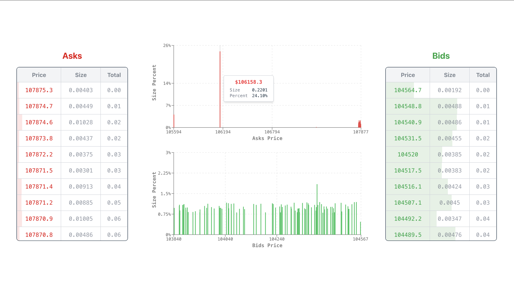
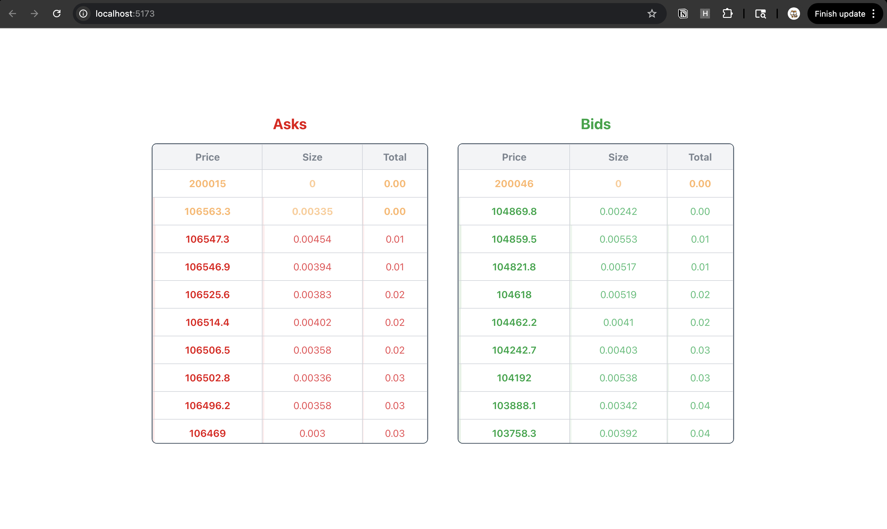

# OrderBook

Fetch order information from `https://zo-devnet.n1.xyz/orderbook?market_id=4` api and display it in a table.

## Polish UI

<div align="center">
    
</div>

### Changes

1. Added order chart to show the distribution of ask/bid prices.
2. Modified the table text to be more readable.
3. Set the default color for ask/bid sizes and total sizes to gray (to avoid the pointless green/red colors).
4. Added hover effect to the table rows.
5. Fixed the row background color error, fill the whole row according the percentage of the total size.

## Features

-   Show ask/bid price, size and total size (sorted by price from high to low)
-   Show percentage of total size for each ask/bid
-   Highlight the newly added ask/bid (orange)

> Added fake data with price higher than 200,000 to test the highlight feature.

## Screenshots

<div align="center">
    
</div>

## How to run

1. Clone the repository:
2. Install dependencies:

    ```bash
    npm install
    ```

3. Start the development server:

    ```bash
    npm run dev
    ```
